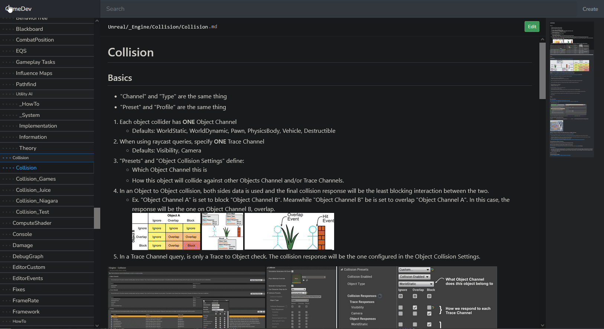

# MDocs

A lightweight web application for creating and managing Markdown files for documentation or personal notes, stored directly on disk with no database required.

## Features

* Create and edit Markdown files through a clean web interface
* Read and write files directly on the filesystem
* Automatically create folders based on URL paths
* Support multiple documentation sites from a single installation
* Upload files via drag-and-drop or paste images directly into the editor
* Attachments use relative paths for better portability
* Live preview editor with autocomplete for snippets, emojis, and file links
* No database required

> Easy navigation with sidebar, dynamic table of contents, image viewer, and minimap.

> Quickly create or edit files by entering a path and starting to write.

## Requirements

* PHP 7.4 or higher
* Web server (e.g., Apache, Nginx)
* Composer
* Node.js and npm

## Installation

1. Clone the repository.
2. Run `composer install` and `npm install`.
3. Create a `.env` file (see **Configuration** below).
4. Run `php artisan serve` or configure a virtual host.

## Configuration

Add the following keys to your `.env` file:

| Name              | Description                                     |
| ----------------- | ----------------------------------------------- |
| `MDOCS_{X}_HOST`  | Hostname used to identify the site              |
| `MDOCS_{X}_DIR`   | Path to the directory where Markdown files live |
| `MDOCS_{X}_NAME`  | Display name of the site                        |
| `MDOCS_{X}_THEME` | Site theme: accepts `"light"` or `"dark"`       |

### Notes

* Replace `{X}` with an incremental site index (e.g., 0, 1, 2...)
* Indices must be **incremental and contiguous**
* Make sure each `MDOCS_{X}_DIR` path is writable by the web server
* For local development, you can use the host from `php artisan serve` (e.g., `127.0.0.1:8000`)

## Shortcuts

| Shortcut | Action                                      |
| -------- | ------------------------------------------- |
| Alt + F  | **Global:** Focus the search input          |
| Alt + N  | **Global:** Focus the filepath input        |
| Alt + E  | **Content:** Edit the current file          |
| Alt + S  | **Editor:** Save and close the editor       |
| Ctrl + S | **Editor:** Save without closing the editor |
| Alt + C  | **Editor:** Cancel editing                  |
| /        | **Editor:** Open file link autocomplete     |
| -        | **Editor:** Open snippet autocomplete       |
| :        | **Editor:** Open emoji autocomplete         |
